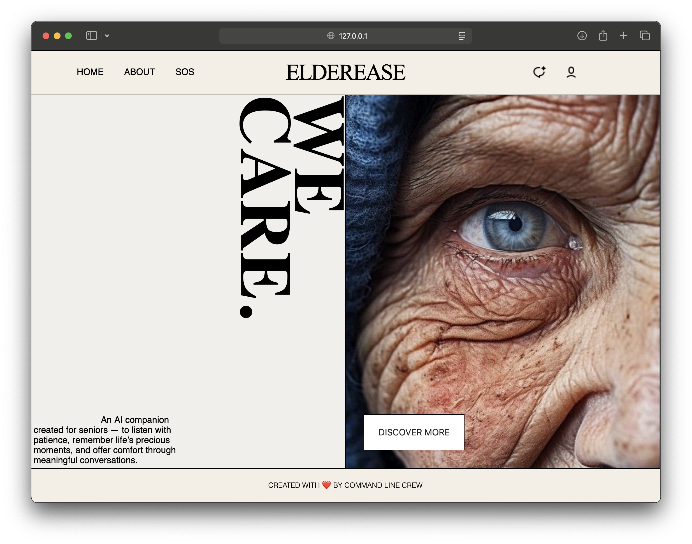
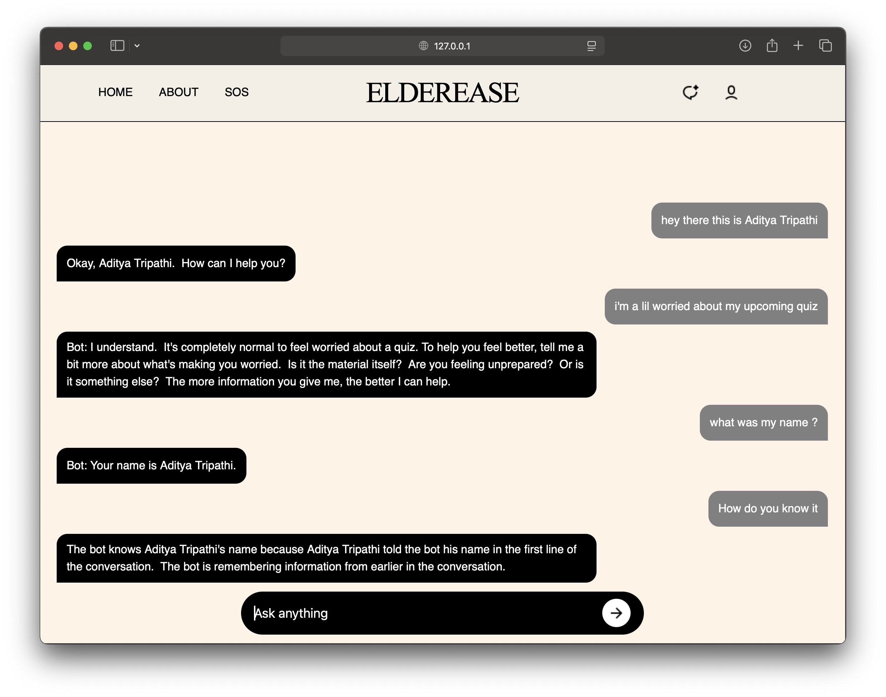

# Elderease

Elderease is an interactive AI companion website designed for seniors. It provides a friendly, patient, and memory-aware assistant that engages users in meaningful conversations while offering a comforting digital presence.

---

## 📸 Screenshots

- **Home Screen**
  

- **Chat Interface**
  

---

## Features

- **Landing Page**: Hero section with a vertical “WE CARE” heading and a descriptive overview.
- **Discover More Panel**: Slide-in panel with a blurred background overlay for additional information.
- **Chat AI Section**: Placeholder for interactive AI chat functionality.
- **Responsive Design**: Adaptable header, hero, and footer for different screen sizes.
- **User-Friendly Interface**: Large buttons, readable fonts, and simple navigation for seniors.

---

## Technologies Used

- **HTML5**
- **CSS3**
- **JavaScript**
- **GSAP** 

---

## Installation

1. Clone the repository:
```bash
git clone https://github.com/your-username/elderease.git
```

2. Open `index.html` in your web browser.

---

## Usage

- Click the **DISCOVER MORE** button to view additional information.
- Click the **CHAT icon** to launch the AI chat interface.
- Click the **SOS** button to call the emergency services

---

## Future Enhancements

- Make the bot agentic so that it can do more than just chatting with people.
- Add sign in option for more personalised experiences.
- Improve accessibility with ARIA labels and screen reader support.

---

## License

The project is free to use, modify and distribute for any fair purpose.

---

## Credits

Created with ❤️ by **Command Line Crew**

